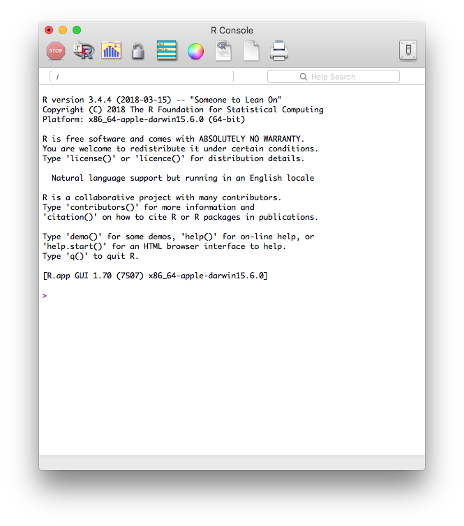
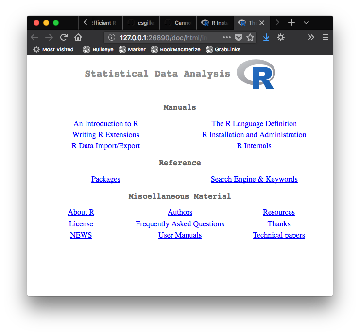
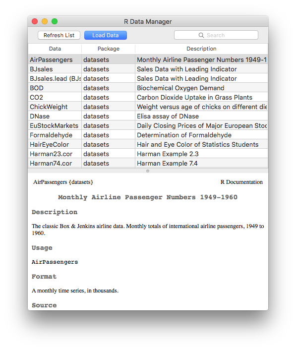
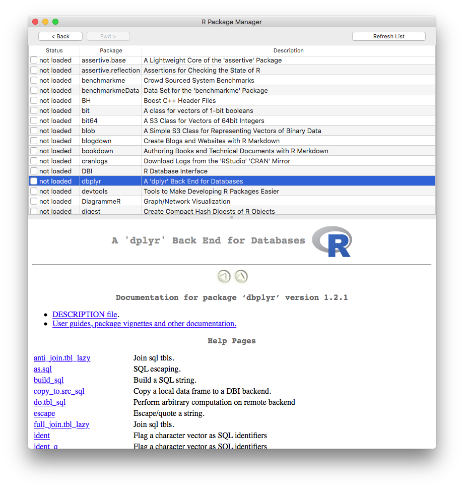

# R For Data Science

> "In Data Science there's always a human in the loop: someone is understanding the insight, seeing the figure, or benefitting from the conclusion."<br /> --- [_David Robinson, Variance Explained Blog_](http://varianceexplained.org/r/ds-ml-ai/)

That person can be called a __Data Scientist__.

## What Is Data Science?

* [Data Science](https://en.wikipedia.org/wiki/Data_science) is a discipline that uses *statistics, data analysis, machine learning* and their *related methods* to __understand and analyze actual phenomena__.

* It employs techniques and theories of __mathematics, statistics, information science__, and __computer science__, in particular the subdomains of *machine learning, classification, cluster analysis, uncertainty quantification, computational science, data mining, databases,* and *visualization*.

According to Wikipedia:

* [Data Analysis](https://en.wikipedia.org/wiki/Data_analysis) is a __descriptive process__ of inspecting, cleansing, transforming, and modeling data with the goal of __discovering useful information, suggesting conclusions__, and __supporting decision-making__.

* [Data Mining](https://en.wikipedia.org/wiki/Data_mining) is a particular data analysis technique for __discovering patterns in large data sets__. It focuses on modeling and knowledge discovery for __predictive__ rather than purely __descriptive__ purposes.

* [Data Modeling](https://en.wikipedia.org/wiki/Data_modeling) is a process used to define and analyze the __data requirements needed to support business processes__ within __information systems in organizations__.

* [Business Intelligence](https://en.wikipedia.org/wiki/Business_intelligence) comprises the strategies and technologies used by enterprises for the __data analysis of business information__ to provide historical, current and predictive views of __business operations__.

**R is used in two associated disciplines**, which are often confused as also being Data Science:

* [Machine Learning](https://en.wikipedia.org/wiki/Machine_learning) (ML) gives computer systems the ability to __progressively improve performance of a specific task__ with data, without being explicitly programmed, and

* [Artificial Intelligence](https://en.wikipedia.org/wiki/Artificial_intelligence) (AI), in contrast to the natural intelligence displayed by humans and other animals, is intelligence demonstrated by machines through __Intelligent Agents__  that __perceive their environment__ and __take actions__ to maximize the chance of successfully achieving their designers' intended goals.

**Although they overlap**, Data Science, Machine Learning, and Artificial Intelligence produce different outcomes:

* **Data Science** produces _**insights**_
* **Machine Learning** produces _**prediction**s_
* **Artificial Intelligence** produces _**actions**_

## What Is R?

> R is a functional programming language designed to manipulate, display, and analyse statistical data.

R  is a __free, case-sensitive, interpreted__ language that uses statistical techniques __to perform__ [Data Analysis](https://en.wikipedia.org/wiki/Data_analysis), [Data Mining](https://en.wikipedia.org/wiki/Data_mining), [Data Modeling](https://en.wikipedia.org/wiki/Data_modeling), and [Machine Learning](https://en.wikipedia.org/wiki/Machine_learning), __and to create__  [Artifical Intelligence](https://www.innoarchitech.com/python-vs-or-r-artificial-intelligence-ai-machine-learning-data-science-which-use/) and [Business Intelligence](https://en.wikipedia.org/wiki/Business_intelligence).

* R is a **functional programming language**, not **procedural**.
* It is **vector-based** and **highly-optimised** to speedily and efficiently manipulate and display all types of **numeric** and **graphical** data.
* R **holds data in memory** for speedy access, so it runs
  - **better on fast processors** with lots of memory for **large datasets**
  - but can be run on an **distributed cluster** running [Apache Hadoop](https://hadoop.apache.org/), either
  - on a **local network** or on a **[Hadoop cloud service](https://www.technavio.com/blog/top-16-companies-in-the-hadoop-as-a-service-hdaas-market)**.
* R was **developed from [S](https://en.wikipedia.org/wiki/S_(programming_language))**, which was **created in 1976** by **[John Chambers](https://en.wikipedia.org/wiki/John_Chambers_(statistician))** of **[Bell Labs](https://en.wikipedia.org/wiki/Bell_Labs)**.
* It was **written by [Ross Ihaka](https://en.wikipedia.org/wiki/Ross_Ihaka) and [Robert Gentleman](https://en.wikipedia.org/wiki/Robert_Gentleman_(statistician))** at the **[University of Auckland](https://en.wikipedia.org/wiki/University_of_Auckland)**, New Zealand.
* The name R comes partly from the names of the two authors, and partly as a play on S.
* R was **conceived in 1992** with an initial version released in **1995**, and a stable beta version in **2000**.
* While there are some important differences, most **S code can run unaltered in R**.
* R is currently being actively developed by the **[R Development Core Team](https://www.r-project.org/contributors.html)**, which includes John Chambers.
* Development of R is supported by the **[R Project for Statistical Computing](https://www.r-project.org/)**.
* R is freely available under the **[GNU General Public License](https://www.gnu.org/licenses/gpl-3.0.en.html)**. Pre-compiled binary versions are provided for various operating systems. These are available on **local [CRAN mirrors](https://cran.r-project.org/mirrors.html)**.

> The source code for the R software environment is written primarily in **C, Fortran, and R**, highly-optimised for fast computation of large collections of statistical data.

The **popularity of R has increased substantially** in recent years. As of March 2018, R is **in the top 20 of the [TIOBE index](https://www.tiobe.com/tiobe-index/)**, (Python was ranked #4 at that time).

## Installing R

**R must be installed** on a computer as currently it is **not included** in any operating system. Precompiled versions are available for major systems including **Windows**, **MacOS**, and **Linux**. It may **require compiling** on some Linux distributions.

R is available from the [Comprehensive R Archive Network (CRAN)](https://cran.r-project.org/), via a multinational network of [CRAN Mirrors](https://cran.r-project.org/mirrors.html). **Canadian CRAN mirrors** are hosted at:

* [Simon Fraser University](http://cran.stat.sfu.ca/)
* [Manitoba Unix User Group](http://muug.ca/mirror/cran/)
* [University of Toronto](http://cran.utstat.utoronto.ca/)
* [Dalhousie University](http://mirror.its.dal.ca/cran/)

**Precompiled versions** are available for:

* [Download for Linux](http://cran.stat.sfu.ca/bin/linux/) (SFU)
* [Download for OS X](http://cran.stat.sfu.ca/bin/macosx/) (SFU)
* [Download for Windows](http://cran.stat.sfu.ca/bin/windows/) (SFU)

## Command Line R

R can be run from the command line in a Terminal window:

* `which R` -- find the location of the R executable
* `R --version` -- show the currently installed version of R
* `R` -- start an interactive R session  
  
Version information is shown (as above) and the R command prompt `>` is available.

* `quit()` -- quit an R session**

### Help and Manuals

* Help is available in the usual way with `R --help`

* [Downloadable manuals for R](https://cran.r-project.org/manuals.html) are available in **HTML**, **PDF**, and **EPUB** formats.

* The **LaTeX or Texinfo sources** of the latest version of these documents are contained in every R source distribution, in the subdirectory `doc/manual` of the extracted archive.

* The **HTML versions of the manuals** are also part of most R installations, accessible by entering the function `help.start()` at the R prompt to launch a  page in your default Web browser with links to local R documentation. 

* **Manuals for older R versions** are available in the [archives of the R sources](https://cran.r-project.org/src/base/).

## The R Console Interface

While R has a command line interface, a graphical interface is installed as an executable application `R.app` or `R.exe` for **Windows**, **MacOS**, and **Linux**. With minor platform differences, they are similar to this startup screen on **OS X**:



R commands can be **run from the command prompt** in R Console, similar to using the **command line interface** in a terminal program.

### Access To R Help

**Tooltip help** appears on hovering the cursor over the **icons in the Toolbar** along the top of the Console window. **Access to R Help files** is invoked by entering `help.start()` at the command prompt. This will launch the **R Help server** on your computer and open a **comprehensive Help page** in your Web browser. 

```
> help.start()
starting httpd help server ... done
If the browser launched by '/usr/bin/open' is already running, it is
    *not* restarted, and you must switch to its window.
Otherwise, be patient ...
> 
```



### Data File Management

An R installation includes a treasure-trove of **statistical data files**. These can be seen using the **Data Manager**, available under the _Packages &amp; Data_ menu. Clicking on a dataset will display its **documentation in the lower pane** of the R Data Manager.



### Package Management

**R Console has a built-in Package Management system** that can be invoked from the **Packages &amp; Data** menu. The top pane of the **R Package Manager** window lists all installed packages. Clicking on a package brings up its **Documentation** in the lower window.




## R Packages

### [CRAN Package Repository](https://cran.r-project.org/)

**The Comprehensive R Archive Network** (CRAN) is a network of `ftp` and Web servers around the world that store identical, up-to-date versions of code and documentation for R. Using the nearest [CRAN Mirror](https://cran.r-project.org/) minimises network load.

**Official releases of R source code** (Unix and Windows) are available on CRAN. The  2018-03-15 release is [R-3.4.4 _Someone to Lean On_](https://cran.r-project.org/src/base/R-3/R-3.4.4.tar.gz). Older releases are [available](https://cran.r-project.org/src/base/).

**R documentation is available on CRAN** in [HTML, PDF, and EPUB](https://cran.r-project.org/manuals.html#R-admin) formats. These were created on [Debian Linux](https://debian.org) and may differ for Mac or Windows, but most parts will be identical. The applicable manual is included in the R installation for each OS.

**CRAN maintains tables of [available R packages](https://cran.r-project.org/)** sorted by [date of publication](https://cran.r-project.org/web/packages/available_packages_by_date.html) and [name](https://cran.r-project.org/web/packages/available_packages_by_name.html). To assist [searching for appropriate packages](https://cran.r-project.org/), CRAN offers discipline-based [Task Views](https://cran.r-project.org/web/views/). On April 6 2018, the CRAN package repository contained 12,411 packages.

**All submitted packages are tested regularly** on Debian GNU/Linux, Fedora, OS X, Solaris and Windows. The results are summarized in the [check summary](https://cran.r-project.org/web/checks/check_summary.html).

### Installing CRAN R Packages

The R command `help("INSTALL")` or `help("install.packages")` displays information on how to install packages from CRAN. The general package installation command is:

**To download and install a package** -- `install.packages("PackageName")`   
**To make its library available** -- `library(PackageName)`

### Installing Packages From GitHub

However, not all packages are available on CRAN, but must be downloaded from [GitHub](https://github.com/). To enable this the `devtools` package must be downloaded and made available:

> `install.packages("devtools")`  
> `library(devtools)`

* **devtools' `install_github("DeveloperName/PackageName")`** installs  R packages from GitHub, but it requires the developers [GitHub name](https://help.github.com/articles/setting-your-username-in-git/).

* **githubinstall's `githubinstall("PackageName")`** does not require the developers GitHub name. It also provides some helpful information on gitHub-hosted R packages hosted. This package can be installed from CRAN.

**If a repository package requires compiling the appropriate compilers**, usually for _C++_ or _FORTRAN_, **must be already installed on your system**.

**A more detailed discussion for installing from GitHub** is [available here](https://cran.r-project.org/web/packages/githubinstall/vignettes/githubinstall.html).

### [The tidyverse](https://www.tidyverse.org/)


**The [tidyverse](https://www.tidyverse.org/) is a collection of R packages designed to clean up datasets for analysis**. The _tidyverse philosophy_ has become an important tool of Data Science.  [tidyverse](https://www.tidyverse.org/) packages share the same design philosophy, grammar, and structure. Ease of adoption and use are fundamental principles for all packages of the [tidyverse](https://www.tidyverse.org/). 

**Core `tidyverse` packages:**

* [ggplot2](http://ggplot2.tidyverse.org/) for data visualisation
* [dplyr](http://dplyr.tidyverse.org/) for data manipulation
* [tidyr](http://tidyr.tidyverse.org/) for data tidying
* [readr](http://readr.tidyverse.org/) for data import
* [purrr](http://purrr.tidyverse.org/) for functional programming
* [tibble](http://tibble.tidyverse.org/) for tibbles, a modern re-imagining of data frames

**Two other packages** are considered part of `tidyverse core`:

* [stringr](http://stringr.tidyverse.org/) for working with strings
* [forecats](http://forcats.tidyverse.org/) for resolving factors

**tidyverse packages sometimes conflict with other packages**. You'll see this displayed on installing a [tidyverse](https://www.tidyverse.org/) package. You can:

* **list conflicts with other installed R packages at any time**  
with `tidyverse_conflicts()`, and

* **Check that all [tidyverse](https://www.tidyverse.org/) packages are up-to-date**  
with `tidyverse_update()`.

**[Chapter 12](http://r4ds.had.co.nz/tidy-data.html) of the seminal book [R For Data Science](http://r4ds.had.co.nz/)** explains in detail how to use [tidyverse](https://www.tidyverse.org/) packages to clean up data prior to analysis. Learning how to use the [tidyverse](http://tidyverse.org/) is the recommended first step to mastering R programming for Data Science.

####  [ggplot2](http://ggplot2.tidyverse.org/)

**A system for declaratively creating graphics** based on [The Grammar of Graphics](vita.had.co.nz/papers/layered-grammar.pdf), `ggplot2` was created by [Hadley Wickham](http://hadley.nz/). You provide the data; tell `ggplot2` how to map variables to aesthetics and what graphical primitives to use; it takes care of the details.

####  [dplyr](http://dplyr.tidyverse.org/)

**A grammar of data manipulation**, `deplyr` provides a consistent set of verbs to solve most common data manipulation challenges. It abstracts how the data is stored, so it works as well with remote databases as with local data frames, using exactly the same R code.

####  [tidyr](http://tidyr.tidyverse.org/)

**The goal of tidyr is to create tidy data**. Tidy data describes a standard way of storing data so it can be used anywhere in the [tidyverse](https://www.tidyverse.org/). If you ensure that your data is tidy, youll spend less timing fighting with the tools and more time working on analysis.

####  [readr](http://readr.tidyverse.org/)

**Provides a fast and friendly way to read rectangular data** --- comma-separated, tab-separated, fixed-width, and general-delimited files, as well as tables separated by white space, and web log files. [readr](http://readr.tidyverse.org/) flexibly parses data while failing cleanly if the data changes.

####  [purrr](http://purrr.tidyverse.org/)

**A complete toolset for working with functions and vectors**, `purrr` functions offer many advantages over the equivalents in base R. For example, the `purrr` family of `map()` functions replace many `for` loops with code that is both more succinct and easier to read.

####  [tibble](http://tibble.tidyverse.org/)

**A modern reimagining of the data.frame**, _tibbles_ keep what has proven to be effective. _tibbles_ are both lazy and surly: they do less (they dont change variable names or types, or do partial matching), and they complain more (for example when a variable does not exist).

####  [stringr](http://stringr.tidyverse.org/)

**Designed to make working with strings as easy as possible**. [stringr](http://stringr.tidyverse.org/) focusses on the most important and commonly-used string manipulation functions. It is built on top of [stringi](https://github.com/gagolews/stringi), which provides a comprehensive set covering almost anything you can imagine.

####  [forcats](http://forcats.tidyverse.org/)

**A suite of tools to solve problems with factors**. R uses factors to handle categorical variables that have a fixed and known set of possible values. Many base R functions convert character vectors to factors, but [tidyverse](http://tidyverse.org/) packages don't create them automatically.

