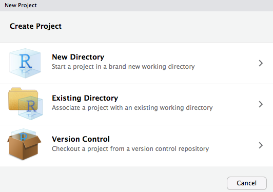
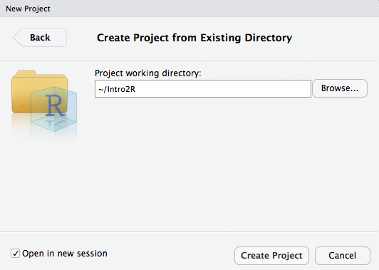
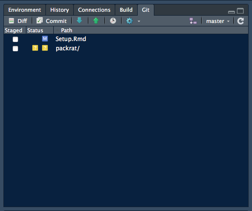
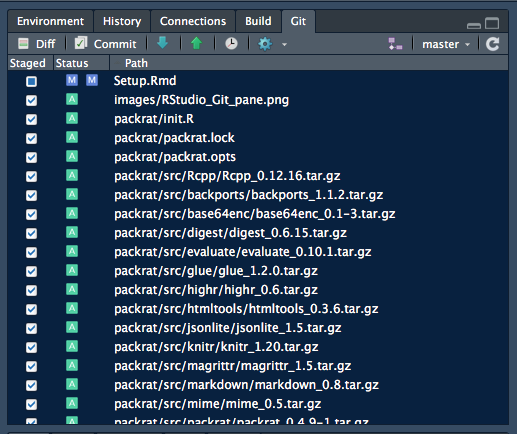
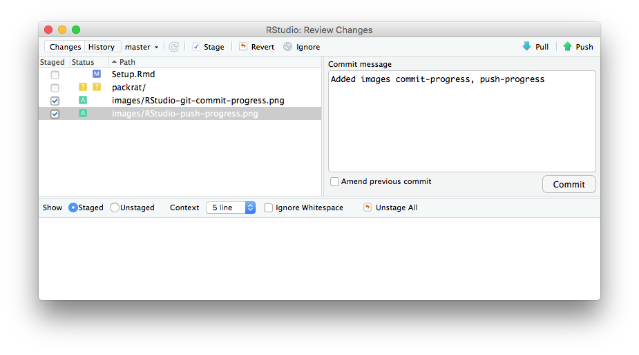
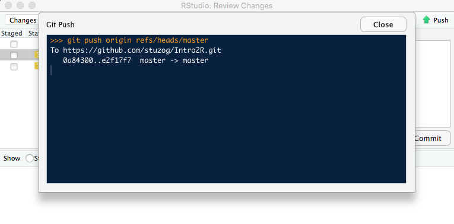
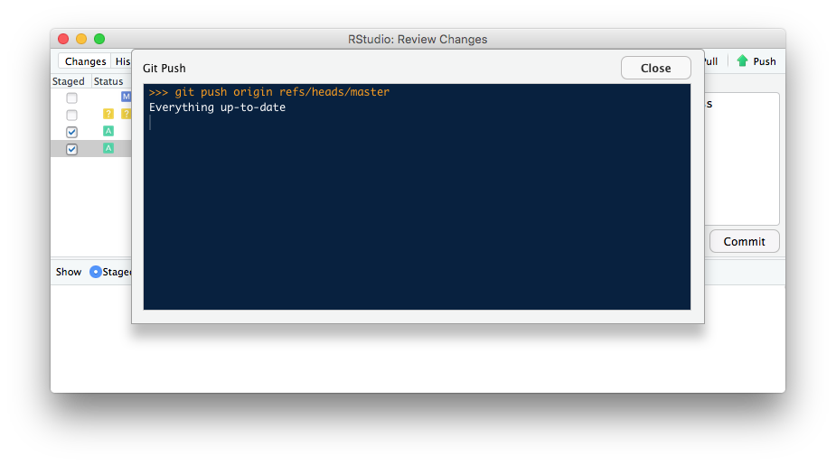

# Setup

> You will get the most benefit from this Tutorial Series if you set it up as an RStudio Project and become familiar with the RStudio IDE.

## Requirements

**This series of tutorials on R can be run on the major computer platforms -- Mac, Linux, and  Windows**.

The necessary files are available in a [GitHub repository](https://github.com/stuzog/Intro2R.git). To download and use them you will need these programs installed on your computer:

* [R](https://www.r-project.org/)
* [RStudio](https://www.rstudio.com/products/rstudio/download/)
* [git](https://git-scm.com/book/en/v2/Getting-Started-Installing-Git)

Once these are properly set up, you can proceed to Installation:

## Quick Summary

**The stages of installing this RStudio Project are**:

1. Install `r` and `git` on your computer
1. Decide where to put the _Project Directory_
1. `cd` into what will be its parent directory
1. Clone the project files from GitHub
1. Install and open RStudio on your computer
1. Create a new RStudio Project in the _Project Directory_
1. Install and initialise `packrat`
1. Set up an account on GitHub if you don't have one
1. Create a new repository in your GitHub account
1. Add it to RStudio as a _Github destination_
1. Push the files in your Project Directory to GitHub
1. Continue to [Part1](Part1_R_Data_Science.html) of your introduction to R

It may look intimidating, but it's fairly easy to work through.

## Installation Details

Carefully follow these instructions, in this order.

### Create The Project Directory

1. In your Terminal program, `cd` into the directory where you want to create the new Project. This can be located wherever you want. It will be called `Intro2R`, so there should not be an existing directory with the same name in that location.

2. Enter the following commands one at a time at the command line in your Terminal program. Follow each line by a `RETURN`:

```
git clone https://github.com/stuzog/Intro2R.git
cd Intro2R
ls -al
```

You should see a listing of the GitHub repository files (with your user name):

```
total 184
drwxr-xr-x   18 (username)  staff    612 18 Apr 09:10 .
drwxr-xr-x@ 149 (username)  staff   5066 18 Apr 09:10 ..
-rw-r--r--    1 (username)  staff      0 18 Apr 09:10 .Rhistory
-rw-r--r--    1 (username)  staff    117 18 Apr 09:10 .Rprofile
drwxr-xr-x   12 (username)  staff    408 18 Apr 09:10 .git
-rw-r--r--    1 (username)  staff     26 18 Apr 09:10 .gitignore
-rw-r--r--    1 (username)  staff    536 18 Apr 09:10 How.Rmd
-rw-r--r--    1 (username)  staff    225 18 Apr 09:10 Intro2R.Rproj
-rw-r--r--    1 (username)  staff  18366 18 Apr 09:10 Part1_R_Data Science.Rmd
-rw-r--r--    1 (username)  staff  13654 18 Apr 09:10 Part2_R_Programming.Rmd
-rw-r--r--    1 (username)  staff   1360 18 Apr 09:10 README.md
-rw-r--r--    1 (username)  staff  12253 18 Apr 09:10 RStudio.Rmd
-rw-r--r--    1 (username)  staff   8000 18 Apr 09:10 RStudio_Ecosystem.Rmd
-rw-r--r--    1 (username)  staff   2071 18 Apr 09:10 R_Learning_Resources.Rmd
-rw-r--r--    1 (username)  staff    817 18 Apr 09:10 _site.yml
drwxr-xr-x   31 (username)  staff   1054 18 Apr 09:10 images
-rw-r--r--    1 (username)  staff   1682 18 Apr 09:10 index.Rmd
-rw-r--r--    1 (username)  staff    687 18 Apr 09:10 intro.css
```

### Make It An RStudio Project

3. **Launch RStudio on your computer**. Unless you have used RStudio before, you will see a fairly unpopulated RStudio window.

4. **Start a new RStudio project** by clicking on `R Projects` in the upper-right corner of the RStudio window, or via the _File > New Project..._ menu item. The _Create New Project_ window will appear:



5. **Select _Existing Directory_** and navigate to the newly-created `Intro2R` project directory. Click _Open in new session_ if you wish to preserve the current RStudio session.



6. **Click _Create Project_**. You will see the following `Error` and `Warning` messages, which you can ignore for now. They will be corrected later in the setup.

```
Error in file(filename, "r", encoding = encoding) : 
  cannot open the connection
In addition: Warning message:
In file(filename, "r", encoding = encoding) :
  cannot open file 'packrat/init.R': No such file or directory
```

### Install `packrat`

**Because R packages are updated frequently**, it is recommended that you use a [project package management](http://r.stuzog.com/RStudio.html#project-package-management) system. This project uses the [`packrat`](https://rstudio.github.io/packrat/) package dependency management system for R, so this should now be installed.

7. **In the _Console window_** at the bottom left of the RStudio interface, enter the following commands followed by `RETURN`, one at a time:

```
install.packages("packrat")
packrat::init()
```

The Console will install `packrat` and the dependencies required for the project:

```
> install.packages("packrat")
Installing package into ‘/Users/(username)/Library/R/3.4/library’
(as ‘lib’ is unspecified)
trying URL 'https://cran.rstudio.com/bin/macosx/el-capitan/contrib/3.4/packrat_0.4.9-1.tgz'
Content type 'application/x-gzip' length 214137 bytes (209 KB)
==================================================
downloaded 209 KB


The downloaded binary packages are in
	/var/folders/qt/6jh4c4yn5zdbf07t61nmz0_w0000gn/T//Rtmptyh6x4/downloaded_packages
> packrat::init()
Initializing packrat project in directory:
- "~/Intro2R"

Adding these packages to packrat:
              _        
    Rcpp        0.12.16
    backports   1.1.2  
    base64enc   0.1-3  
    digest      0.6.15 
    evaluate    0.10.1 
    glue        1.2.0  
    highr       0.6    
    htmltools   0.3.6  
    jsonlite    1.5    
    knitr       1.20   
    magrittr    1.5    
    markdown    0.8    
    mime        0.5    
    packrat     0.4.9-1
    rmarkdown   1.9    
    rprojroot   1.3-2  
    stringi     1.1.7  
    stringr     1.3.0  
    yaml        2.1.18 

Fetching sources for Rcpp (0.12.16) ... OK (CRAN current)
Fetching sources for backports (1.1.2) ... OK (CRAN current)
Fetching sources for base64enc (0.1-3) ... OK (CRAN current)
Fetching sources for digest (0.6.15) ... OK (CRAN current)
Fetching sources for evaluate (0.10.1) ... OK (CRAN current)
Fetching sources for glue (1.2.0) ... OK (CRAN current)
Fetching sources for highr (0.6) ... OK (CRAN current)
Fetching sources for htmltools (0.3.6) ... OK (CRAN current)
Fetching sources for jsonlite (1.5) ... OK (CRAN current)
Fetching sources for knitr (1.20) ... OK (CRAN current)
Fetching sources for magrittr (1.5) ... OK (CRAN current)
Fetching sources for markdown (0.8) ... OK (CRAN current)
Fetching sources for mime (0.5) ... OK (CRAN current)
Fetching sources for packrat (0.4.9-1) ... OK (CRAN current)
Fetching sources for rmarkdown (1.9) ... OK (CRAN current)
Fetching sources for rprojroot (1.3-2) ... OK (CRAN current)
Fetching sources for stringi (1.1.7) ... OK (CRAN current)
Fetching sources for stringr (1.3.0) ... OK (CRAN current)
Fetching sources for yaml (2.1.18) ... OK (CRAN current)
Snapshot written to '/Users/Stuart/Intro2R/packrat/packrat.lock'
Installing Rcpp (0.12.16) ... 
	OK (downloaded binary)
Installing backports (1.1.2) ... 
	OK (downloaded binary)
Installing base64enc (0.1-3) ... 
	OK (downloaded binary)
Installing digest (0.6.15) ... 
	OK (downloaded binary)
Installing glue (1.2.0) ... 
	OK (downloaded binary)
Installing highr (0.6) ... 
	OK (downloaded binary)
Installing jsonlite (1.5) ... 
	OK (downloaded binary)
Installing magrittr (1.5) ... 
	OK (downloaded binary)
Installing mime (0.5) ... 
	OK (downloaded binary)
Installing packrat (0.4.9-1) ... 
	OK (downloaded binary)
Installing stringi (1.1.7) ... 
	OK (downloaded binary)
Installing yaml (2.1.18) ... 
	OK (downloaded binary)
Installing rprojroot (1.3-2) ... 
	OK (downloaded binary)
Installing htmltools (0.3.6) ... 
	OK (downloaded binary)
Installing markdown (0.8) ... 
	OK (downloaded binary)
Installing stringr (1.3.0) ... 
	OK (downloaded binary)
Installing evaluate (0.10.1) ... 
	OK (downloaded binary)
Installing knitr (1.20) ... 
	OK (downloaded binary)
Installing rmarkdown (1.9) ... 
	OK (downloaded binary)
Initialization complete!

Restarting R session...

> 
```

8. **Click the _Packages tab_ in the _Files....Viewer pane_** (usually bottom right). It will now show a list of packages installed in the Project's dedicated  _Packrat Library_:


9. **Click _Update_ in the _Packages tab toolbar_** to ensure that all project packages are current. Packages are updated frequently, so it is advisable to do this from time to time.

## GitHub Version Control

**It's a really good idea to track your R coding with some form of [version control](https://support.rstudio.com/hc/en-us/articles/200532077-Version-Control-with-Git-and-SVN)**.

RStudio makes this easy for you. 

**[git](https://git-scm.com/) and [GitHub](https://github.com/explore) have become the leading version control system** --- there's even a [free eBook](https://git-scm.com/book/en/v2) about `git` available for download . There also are some [easy-to-understand explanations](https://r-bio.github.io/intro-git-rstudio/) on how `git` works available on the Web.

**`git` support is built-in to RStudio**. This makes keeping track of your many ch-ch-ch-changes an integral part of your R programming workflow.

### Setting Up `git` In RStudio

How you set up `git` in RStudio depends on whether you are:

* **Starting a new Project**:
  * [first from GitHub](http://happygitwithr.com/new-github-first.html)
  * [from RStudio](https://support.rstudio.com/hc/en-us/articles/200532077-Version-Control-with-Git-and-SVN)
  * [from a GitHub clone](http://happygitwithr.com/clone.html)
* **Adding `git` to an existing Project**
  * [starting from GitHub](http://happygitwithr.com/existing-github-first.html), or
  * [starting from RStudio](http://happygitwithr.com/existing-github-last.html)

Each alternative takes a slightly different path through the RStudio/GitHub maze. They are best detailed in [Happy Git and GitHub for the useR](http://happygitwithr.com/) by Jenny Bryan and the STAT 545 Teaching Assistants of UBC. [RStudio's version control guide](https://support.rstudio.com/hc/en-us/articles/200532077-Version-Control-with-Git-and-SVN) also shows how to use `git` or an [SVN repository](http://subversion.apache.org/) for version control.

### Using `git` In RStudio

**When `git` is properly set up, a new _Git_ tab** will appear in the _Environment... Build_ pane. Clicking on this tab will show files and directories that have changed since the last synchronisation with the _GitHub repository_ associated with this Project. If you keep this tab open, you will see its contents change each time you save a file, or rebuild an entire Web site.



**The _GitHub Push_ workflow is**:

1. _Stage_ any modified file or directory
1. _Commit_ selected _Staged_ files or directories, adding a brief _Commit message_
1. _Push_ all _Committed_ files/directories to a _GitHub repository_.

**If you're new to `git` and somewhat intimidated by it**, [A Visual Introduction to Git](https://medium.com/@ashk3l/a-visual-introduction-to-git-9fdca5d3b43a) gives an amusing introduction to the basic `git` workflow.

**For a detailed overview from a developer perspective** see [Git and GitHub](http://r-pkgs.had.co.nz/git.html) by Hadley Wickham. It particulaly refers to R package development.

#### Staging Changed Items

1. **Click its _Staged_ checkbox**  A small blue box  appears in the left _Status_ column, showing that the file or directory was _Modified_ and ready for a _Commit_. If you had only added the file, a small green box  will appear. The _Staged_ checkbox then changes to a tickmark .

1. **If you click on a listed directory**, its contents will all appear, marked _Staged_ and with small green boxes  signifying that they have been _Added._



3. **To _Unstage_ added sub-directories or files** you either deselect each individually then deselect the _Staged_ parent directory (_Tip:_ Start with the bottom one and keep clicking!), or `SHIFT Click` all of them and uncheck  one _Selected_ radio button.

#### Those little `git` icons?

In the _Status_ column, you'll see little yellow, blue, or red icons. They mean:

 - _New file_ or directory that does not exist in the `git` _Repository_  
 - _Modified_ from what is in the `git` _Repository_  
 - _Staging_ a file or adding it to be committed  
 - The item has been _Deleted_

The _Status_ column has a _left_ and _right_ icon alignment:

_icon on the left_ - the item has been _Staged_  
_icon on the right_ - the item is _Not Staged_

Sometimes you'll see icons in both columns:

  - _Not in the Repository_ and has changed recently  
  - _Staged_ and _Modified_ since it was _Staged_

In the last case, the _Staged_ checkbox will be filled with a solid blue .

You'll see how it all works as you continue with RStudio.

#### Committing Staged Items

When you have _Staged_ everything you want, the next step is to _Commit_ those _Staged_ items.

4. **Click the _Commit_ button to do this**. The _Review Changes_ window appears. You can add a message to remind you (and others) what you have done in this _Commit_. This is always advisable, especially for others reviewing your repository.



A smaller _Progress window_ will open over the _Review window_. It is actually a small _Terminal window_ showing what you would see if you were at the command line.


#### Pushing To GitHub

5. Your files are now Committed; the next step is to **Push** them to the Repository. The `green up-arrow` is the **Push button**. You may have to close the _Progress window_ first.



6. If everything went well, you will see the above message in the _Progress window_ (opens automatically if you had closed it).



